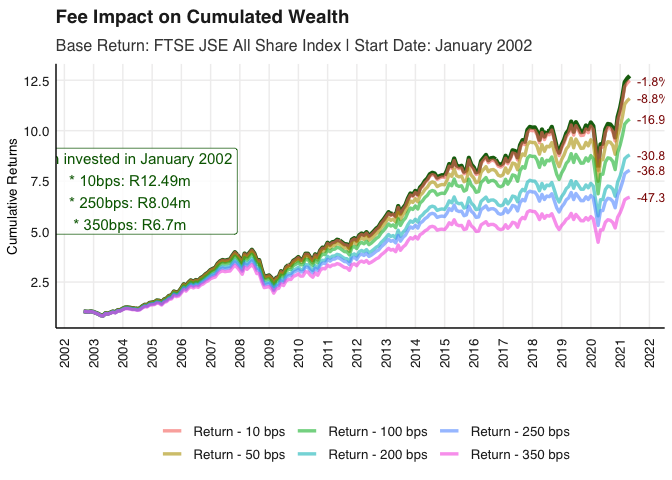

# FM 871 Bonus Practical -HLVZ

This repository is dedicated to the bonus practical of the financial
econometrics 871 course which investigates the varying impact of
different fee levels on cumulative returns. Write up contained in
`Tyranny_of_Fees.html` .

## Tyranny of Fees

We use the fmxdat::Jalshtr dataset which contains TRI data from 2002 to
2021.

The first step is to transform the daily return to monthly, which is
assigned to the `Jalshtr` variable in the `code/data_prep.R` script.

Next, we create the function `Cum_Fee_Comparison` in the
`code/Cum_Fee_Comp.R` script. This function creates a plot which
illustrates the cumulative impact of fees on overall wealth.

This is achieved by converting multiple levels of annually compounded
fees as measured in basis points (10, 50, 100, 250, 350) into their
monthly equivalent, this is deducted from gross returns for that month
(calculated in `Jalshtr`) which yields the net returns for the month.
The ratio of the cumulative products of net returns to gross returns are
calculated and plotted for each fee level at each month, allowing us to
see their impact over time.

This function can take first date of observation as an input. In the
associated `Tyranny_of_Fees.html` write-up we illustrate how the
compounding effect of fees over time can drastically impacts long term
wealth.

## Example of plot in action

Using 2002 as starting point

<!-- -->
