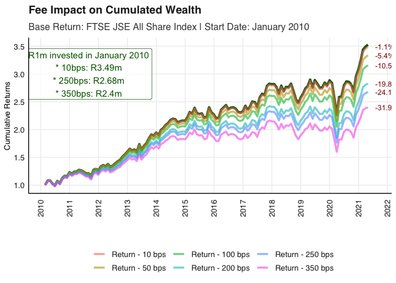

# FM 871 Bonus Practical -HLVZ

This repository is dedicated to the bonus practical of the financial
econometrics 871 course which investigates the varying impact of
different fee levels on cumulative returns.

## Tyranny of Fees

We use the fmxdat::Jalshtr dataset which contains TRI data from 2002 to
2021.

The first step is to transform the daily return to monthly, which is
assigned to the `Jalshtr` variable.

Next we create a function that converts various scales of annually
compounded fees into their monthly equivalent and deduct this from gross
returns for that month. Finally calculated the net returns as a
percentage of gross returns and compare impact on wealth for R1 million
initial investment in 2002.

<!-- -->

Let’s compare the same but starting from 2010

<!-- -->
